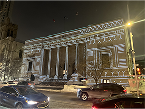

toute l'information sur l'exposition marée montante de Glenn gear va aller ici

# Marée montante

Je suis allé voir l'esposition marée montante de Glenn gear pour mieux comprendre le dispositif multimédias

  

## devant l'exposition marée montante

## description

*Marée montante* est une exposition extérieure temporaire. Elle a été créée le 1er octobre 2024 par Glenn Gear, et elle se finira le 30 mars 2025. Je suis allée visiter cette exposition le 20 février 2025. L'œuvre est assez simple vue de l'extérieur ; elle consiste en une projection murale qui bouge et se modifie dans le style géométrique des Inuits. Malgré son air simpliste, diffuser une projection sur une façade si peu plate est très compliqué. Il faut prendre en compte toutes les imperfections pour avoir une projection optimale. La projection est réalisée sur la façade du musée des beaux-arts de Montréal. L'installation est contemplative puisqu'elle sert juste à être regardée. *Marée Montante* a été conçue pour faire réfléchir les gens sur l'impact de l'humain sur son environnement naturel et vice versa.

### photo de l'exposition

côté droit  |  projecteur |  devant  |  cartel  
:-------------------------:|:-------------------------:|:-------------------------:|:-------------------------:
|||

### expérience utillisateur 

D'après moi, la projection était plutôt belle et éclairait bien la rue, ce qui la rendait plus vivante et joyeuse. Donc, si cette œuvre était proche de chez moi, ça serait sûrement un endroit amusant à marcher proche de nuit. Cependant, je ne crois pas qu'elle soit assez intéressante pour que quelqu'un se déplace volontairement pour aller la voir, puisqu'elle manque de contexte et le but désiré de l'œuvre semble être raté. Avec ce que j'ai vu, les gens ne sont pas vraiment intéressés par cette projection lambda et ne cherchent pas à comprendre pourquoi elle existe et pourquoi elle est sur un bâtiment aussi important. Pourtant, le but de l'œuvre est quand même intéressant, mais il rate son public cible. D'après moi, soit ils ont mal conçu leur idée générale, soit, comme je le pense, ils ont mal justifié leur moyen (la projection) pour faire comprendre le but (faire réfléchir les gens sur l'impact de l'humain sur son environnement naturel et vice-versa). Je pense qu'ils auraient pu ajouter une affiche ou quelque chose dans la projection qui explique clairement le but, et l'œuvre aurait été beaucoup mieux perçue.

