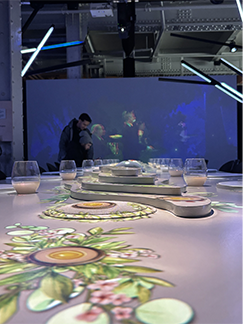

toute l'information sur l'expo va aller ici

# Le Banquet

Nous sommes allé a l'exposition du centre des sciences Le Banquet pour y explorer les différents dispositif multimédias présent.

## devant l'exposition

## description

l'exposition a été réaliser au centre des science de Montréal, l'exposition est a l'intérieur et est temporaire, nous sommes allez visité cette exposition le 31 Janvier 2025 dans le cadre du cours d'oeuvre et disposition en exposition, Le Banquet a été réaliser grace a la société immobilière du Canada, elle a été créé le 16 Mai 2024. Le dispositif consiste en une grande table a manger immersive ou des gens viennent s'assir, au alentour de la table se retrouve plusieurs écrans, au dessus de la table se retrouve plusieurs projecteurs, les ecrans et les projecteurs diffusent des vidéos pour nous immerger dans un autre monde, pour plus d'immersion de petit dispositif odorifique sont placé juste en desous des assiettes disposer sur la table. pour fonctionner l'exposition a besoin d'être à l'intérieur d'une salle plonger dans un noir presque totale puisqu'elle fonctionne presque qu'exclusivement avec des projecteurs, donc le centre des sciences a probablement du mettre des cloisons et des rideaux noirs.

### photo de l'exposition

   

### expérience utillisateur 

D'après moi l'idée de l'expositions était bien cependant la réalisation laissait un peu a désiré, l'odeur qui sortait était vraiment nauséabonde et ce n'était clairment pas intentionnel, mais le reste de l'expérience était plutôt agréable la projection était assé bien réalisé malgré quelque rares erreurs de placement nous avons eu beaucoup de plaisir a expérimenter ce dispositif surtout grâce a son immersion 
