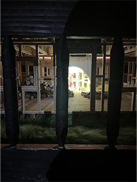

# Wakonda

je suis allé visité l'exposition art contemporain et l'oeuvre *camp Wakonda* au Musée des beaux arts de Montréal (MBAM) 

## Affiche de l'exposition 

## Enssemble de l'oeuvre

vue complète  |  cartel
:-------------------------:|:-------------------------:
|

vue de proche |  vue accident |  vue salle 1 |  vue salle 2 |  vue salle 3
:-------------------------:|:-------------------------:|:-------------------------:|:-------------------------:|:-------------------------:
|||||||

L'œuvre *Camp Wakonda* est une œuvre permanente du Musée des beaux-arts de Montréal. C'est une œuvre contemplative qui expose une petite ville remplie de violence: un accident tragique entre un autobus et une voiture, des hommes-animaux qui se battent contre des animaux qui leur ressemblent, et des bâtiments miteux à moitié finis. L'œuvre contient 5 salles principales (en comptant le pont au milieu), chacune de ces salles ayant une projection différente, semblant raconter une histoire.

## Éléments nécessaires à la disposition

L'œuvre a besoin d'au moins 5 projecteurs et 2 haut-parleurs pour diffuser dans les 5 salles et avoir les sons liés aux actions des personnages. Elle a besoin d'être dans une salle plongée dans le noir pour que le feu et les projections soient quasiment la seule source de lumière — c'est utile pour l'immersion — et elle a besoin de quelques lampes peu fortes pour augmenter l'impact de l'œuvre.

projecteur  |  haut parleur/projecteur
:-------------------------:|:-------------------------:
|

## Expérience utilisateur

*Camp Wakonda* est très amusant à expérimenter parce qu'il fait réfléchir : pourquoi ils ont des têtes d'animaux ? Pourquoi il y a un accident ? En plus de cela, l'œuvre est très belle et très immersive grâce au bruit du crépitement du feu et des tirs d'arc à flèche. Pour une des premières fois de ma vie, j'ai eu envie de comprendre l'œuvre d'art et de comprendre le message qui voulait être transmis. Ce qui est bien avec Camp Wakonda, c'est que personne ne sortira indifférent et personne ne sortira sans avoir une version de l'histoire.

