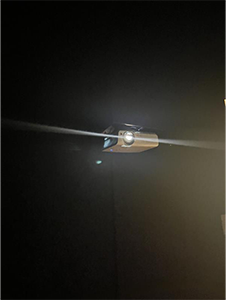

# Wakonda

je suis allé visité l'exposition art contemporain et l'oeuvre *camp Wakonda* au Musée des beaux arts de Montréal (MBAM) 

## Affiche de l'exposition 

## Enssemble de l'oeuvre

vue complète  |  cartel
:-------------------------:|:-------------------------:
|

vue de proche |  vue accident |  vue salle 1 |  vue salle 2 |  vue salle 3
:-------------------------:|:-------------------------:|:-------------------------:|:-------------------------:|:-------------------------:
|||||||

L'oeuvre *camp Wakonda* est une oeuvre permanente du musée des beaux arts de Montréal, c'est une oeuvre comtemplative qui expose une petite ville remplie de violence, un accident tragique entre un autobus et une voiture, des hommes animaux qui se battent contre des animaux qui leurs ressemble et des batiment miteux a moitié fini. L'oeuvre contient 5 salle principale (en comptant le pont au milieu), chacune de ces salles ayant une projection différente semblant raconté une histoire.

## Élément nécéssaire à la disposition

L'oeuvre a besoin d'au moins 5 projecteur et 2 haut parleur pour diffuser dans les 5 salles et d'avoir les sons liée au action des personnages, elle a besoin d'être dans une salle plongé dans le noir pour que le feu et les projections soit quasiment la seule source de lumière c'est utile pour l'immersion et elle a besoin de quelque lampes peu forte pour augmenter l'impact de l'oeuvre.

projecteur  |  haut parleur/projecteur
:-------------------------:|:-------------------------:
|

## experience utilisateur

*Camp Wakonda* est très amusant a expérimenter parce qu'il fait réfléchir: pourquoi ils ont des têtes d'animaux ? pourquoi il y a un accident ? En plus de cela l'oeuvre est très belle et très immersive grace au bruit du crépitement du feu et des tirs d'arc à flèche. Pour une des première fois de ma vie j'ai eu envi de comprendre l'oeuvre d'art et de comprendre le message qui voulait être transmis. Ce qui est bien avec *camp Wakonda* c'est que personne ne sortira indifférent et personne ne sortira sans avoir une version de l'histoire.   
