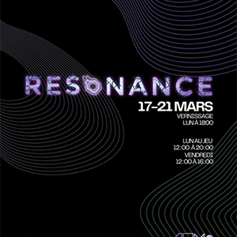

# Étheria

## Exposition
affiche de l'événement

Nous sommes allée visité l'exposition Résonance conçu par les finissants du programme TIM du cégep Montmorency, cette page parlera specifiquement du projet Étheria conçu par :
Joshua Gonzalez Barrera, Victor Gileau, Michael Un Dupré, Pierre-Luc Proulx et Maik Hamel

Joshua Gonzalez Barrera  |  Victor Gileau  |  Michael Un Dupré  |  Pierre-Luc Proulx  |  Maik Hamel
:-------------------------:|:-------------------------:|:-------------------------:|:-------------------------:|:-------------------------:
||||

### Joshua Gonzalez Barrera  

### Victor Gileau

### Michael Un Dupré

### Pierre-Luc Proulx

### Maik Hamel

Lors de ma visite le 18 mars 2025, j'ai décidé de choisir le projet Etheria à cause de leur créativité et du style original de leur oeuvre. L'oeuvre consiste en une sorte de jeu de société mélangé a un jeu vidéo, je m'explique le jeu est disposé sur une table et le style ressemble pas mal a un jeu de société avec des pions et des carrés définissant la carte, cependant le style de jeu et les animations sont beaucoup plus penché vers un jeu vidéo. l'oeuvre est intéractive, c'est a dire que l'on peut intéragir avec

type: interactive 

photo de mise en espace

Éléments nécessaires à la mise en exposition

Expérience vécue

❤️ Ce qui vous a plu, vous a donné des idées

🤔 Aspect que vous ne souhaiteriez pas retenir pour vos propres créations ou que vous feriez autrement

Références****
