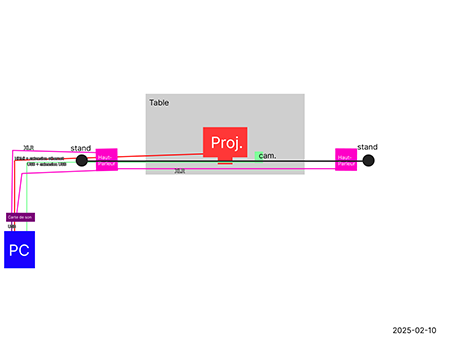

# Etheria

Nous sommes allée visité l'exposition Résonance conçu par les finissants du programme TIM du cégep Montmorency, cette page parlera specifiquement du projet Etheria conçu par :
Joshua Gonzalez Barrera, Victor Gileau, Michael Un Dupré, Pierre-Luc Proulx et Maik Hamel

Joshua Gonzalez Barrera  |  Victor Gileau  |  Michael Un Dupré  |  Pierre-Luc Proulx  |  Maik Hamel
:-------------------------:|:-------------------------:|:-------------------------:|:-------------------------:|:-------------------------:
||||

## Qu'est ce qu'est Etheria 
Lors de ma visite le 18 mars 2025, j'ai décidé de choisir le projet Etheria à cause de leur créativité et du style original de leur oeuvre. L'oeuvre consiste en une sorte de jeu de société mélangé a un jeu vidéo, je m'explique le jeu est disposé sur une table et le style ressemble pas mal a un jeu de société avec des pions et des carrés définissant la carte, cependant le style de jeu et les animations sont beaucoup plus penché vers un jeu vidéo. l'oeuvre est intéractive, c'est a dire que l'on peut intéragir avec

cartel  |  Etheria  |  projection
:-------------------------:|:-------------------------:|:-------------------------:
||

## Élément nécéssaire a la disposition
Pour faire fonctionner l'oeuvre ils ont eu besoin
- d'une kinect
- d'un projecteur
- d'une table avec une nappe pour la rendre plus lisse
- d'une imprimante 3D pour faire les 3 pions
- d'un ordinateur pour faire fonctionner le jeu et les animation
- de codes Qr pour que les pions se fassent repéré
- de deux haut parleur pour faire fonctionner le son du jeu et la musique du jeu.

### Plantation

Avant  |  Après
:-------------------------:|:-------------------------:
|

## Avis personnel
D'après moi, cette oeuvre dispose de plusieurs point fort, premièrement, l'ambiance du jeu est très bien réussi elle est très immersive et réussi a capter l'attention des joueurs jusqu'à la fin de la partie. Deuxièmement, le jeu marchait assez bien, je n'ai pas rencontrée d'anomalie informatique durant ma partie. Troisièmement, les personnages se déplaçait plutôt bien la plupart du temps. Pour les points négatifs, je crois que certain objet sur la carte aurait pu être mieux expliqué, parce que cetain <<bonus>> n'était pas très clair. De plus, à certains instant de la partie la kinect ne marchais pas trop, ce qui fesait que les personnages se téléportait et c'était un peu énervant. Pour finir, le projet était vraiment intéressant et amusant malgré quelque rare petite erreur technique.

## Aspect que j'aurait fais différement
Je pense que la kinect aurait pu être placé d'une manière plus efficace puisque comme mentionné précedement elle avait un peu de la misère a repéré les code QR 

### Cours nécéssaire à la conception 

- Intéractivité ludique
- objet intéractif
- animation 2d

