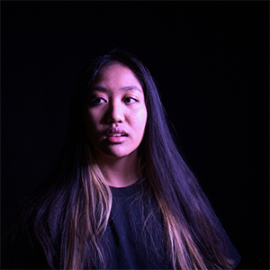

# Tous les projets étudiants

## Exposition

Nous sommes allée visité l'exposition Résonance conçu par les finissants du programme TIM du cégep Montmorency, cette page parlera de tout les projet réalisé par les étudiants de la 6e session du programme et ils seront classé du plus interessant au moins interessant de mon point de vu ( le 1 est mon préféré).

## Projet 1 Etheria

### équipe
Joshua Gonzalez Barrera  |  Victor Gileau  |  Michael Un Dupré  |  Pierre-Luc Proulx  |  Maik Hamel
:-------------------------:|:-------------------------:|:-------------------------:|:-------------------------:|:-------------------------:
||||

Pour en savoir plus sur ce merveilleux projet cliquez ici -> https://github.com/t1ctac19/H25_V11_inspiration_BONNEAU/blob/main/finissant_TIM_resonance/Etheria.md

## Projet 2 Arcadia

### équipe

Dominic Yale  |  William Beauvais  |  Anton Nikulin
:-------------------------:|:-------------------------:|:-------------------------:
||

### Instalation finale

installation  |  Cartel
:-------------------------:|:-------------------------:
|

### Plantation

Avant  |  Après
:-------------------------:|:-------------------------:
|

### Avis
Avant d'avoir expérimenté c³ette oeuvre elle figurait au top 1 de la liste puisque je trouve le concept vraiment interessant: un jeu du style << dark fantasy >> des années 90 qui se joue sur une borne d'arcade. Commençons par les points positif, les graphique et le style du jeu m'on beaucoup impréssionné, j'était surpris par les détailles des décors et du personnages. de plus, le jeu avais un très bon temps de réaction je n'est pas senti qu'il y avait du << input lag >>. Cependant quelque point m'on fait changé d'avis sur sa place de numéro 1. Premièrement, les ennemies touchaient souvent le joueur sans le touché réelement ce que je trouvais vraiment frustrant. Deuxièmement, la difficulté du jeu était trop dificile en grande partie à cause du premier point se qui ma fais décrocher du jeu.

### Cours nécéssaire à la conception 

- Intéractivité ludique
- objet intéractif
- animation 2d

## Projet 3 Luminatura

### équipe

Audrey  |  Justine  |  Camilia  |  Prethiah  |  Ihab
:-------------------------:|:-------------------------:|:-------------------------:|:-------------------------:|:-------------------------:
||||

### Instalation finale

installation  |  Cartel
:-------------------------:|:-------------------------:
|

### Plantation

Arcade  |  Cartel
:-------------------------:|:-------------------------:
|

### Avis
Avant d'avoir expérimenté c³ette oeuvre elle figurait au top 1 de la liste puisque je trouve le concept vraiment interessant: un jeu du style << dark fantasy >> des années 90 qui se joue sur une borne d'arcade. Commençons par les points positif, les graphique et le style du jeu m'on beaucoup impréssionné, j'était surpris par les détailles des décors et du personnages. de plus, le jeu avais un très bon temps de réaction je n'est pas senti qu'il y avait du << input lag >>. Cependant quelque point m'on fait changé d'avis sur sa place de numéro 1. Premièrement, les ennemies touchaient souvent le joueur sans le touché réelement ce que je trouvais vraiment frustrant. Deuxièmement, la difficulté du jeu était trop dificile en grande partie à cause du premier point se qui ma fais décrocher du jeu.

### Cours nécéssaire à la conception 

- Intéractivité ludique
- objet intéractif
- animation 2d

## Projet 4 internature

### équipe

Khaly Tia Sing |  Isaac Fafard  |  Delphine Grenier  |  Sitmonternna Yi  |  Kenza El Harrif
:-------------------------:|:-------------------------:|:-------------------------:|:-------------------------:|:-------------------------:
||||
## Projet 5 Fuga

### équipe

Matis |  Tristan  |  Daniel  |  Abdel  |  Yavuz
:-------------------------:|:-------------------------:|:-------------------------:|:-------------------------:|:-------------------------:
||||

## Projet 6 prismatica

### équipe

Vincent Delisle  |  Ikrame Rata  |  Jérémy Duverseau
:-------------------------:|:-------------------------:|:-------------------------:
||

## Projet 7 condui8

### équipe

Ian Corbin  |  Samuel Desmeules Voyer  |   Alexandre Gervai  |  Kevin Malric  |  Jérémy Roy Coté
:-------------------------:|:-------------------------:|:-------------------------:|:-------------------------:|:-------------------------:
||||

### Instalation finale
vélos  |  écran  |  haut parleur  |  projecteur/kinect  |  cartel  
:-------------------------:|:-------------------------:|:-------------------------:|:-------------------------:|:-------------------------:
||||

### plantation

## source
1.  [Etheria_GitHub](https://ethereal-creators.github.io/Etheria/#/)
2.  [Arcadia_GitHub](https://cousi-cousa.github.io/Arcadia/#/)
3.  [Luminatura_GitHub](https://miaou-mafia.github.io/projet-luminatura/#/)
4.  [Internature_GitHub](https://tprangers.github.io/internature/)
5.  [Fuga_GitHub](https://escapism-fuga.github.io/Fuga/#/)
6.  [Prismatica_GitHub](https://pootpookies.github.io/Prismatica/)
7.  [C0NDU8_GitHub](https://gearshift-games.github.io/Web-C0N-DU8/#/)

