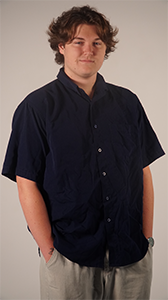
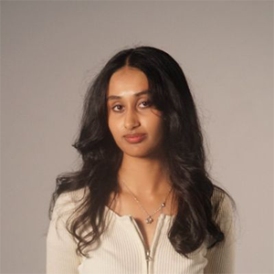
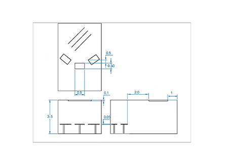
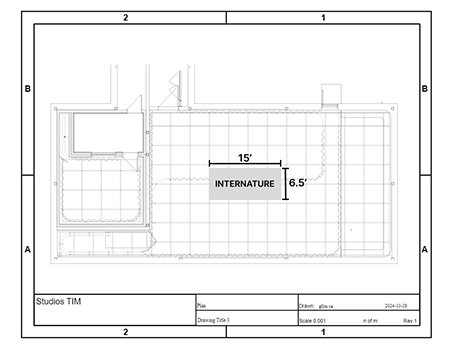
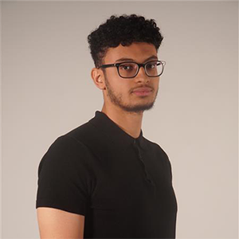
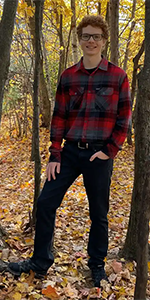

# Tous les projets étudiants

## Exposition

Nous sommes allée visité l'exposition Résonance conçu par les finissants du programme TIM du cégep Montmorency, cette page parlera de tout les projet réalisé par les étudiants de la 6e session du programme et ils seront classé du plus interessant au moins interessant de mon point de vu ( le 1 est mon préféré).

## Projet 1 Etheria

### équipe
Joshua Gonzalez Barrera  |  Victor Gileau  |  Michael Un Dupré  |  Pierre-Luc Proulx  |  Maik Hamel
:-------------------------:|:-------------------------:|:-------------------------:|:-------------------------:|:-------------------------:
||||

Pour en savoir plus sur ce merveilleux projet cliquez ici -> [Etheria_Lucas]https://github.com/t1ctac19/H25_V11_inspiration_BONNEAU/blob/main/finissant_TIM_resonance/Etheria.md

## Projet 2 Arcadia

### équipe

Dominic Yale  |  William Beauvais  |  Anton Nikulin
:-------------------------:|:-------------------------:|:-------------------------:
||

### Instalation finale

installation  |  Cartel
:-------------------------:|:-------------------------:
|

### Plantation

Plantation
:-------------------------:

### Avis
Avant d'avoir expérimenté c³ette oeuvre elle figurait au top 1 de la liste puisque je trouve le concept vraiment interessant: un jeu du style << dark fantasy >> des années 90 qui se joue sur une borne d'arcade. Commençons par les points positif, les graphique et le style du jeu m'on beaucoup impréssionné, j'était surpris par les détailles des décors et du personnages. de plus, le jeu avais un très bon temps de réaction je n'est pas senti qu'il y avait de la latence. Cependant quelque point m'on fait changé d'avis sur sa place de numéro 1. Premièrement, les ennemies touchaient souvent le joueur sans le touché réelement ce que je trouvais vraiment frustrant. Deuxièmement, la difficulté du jeu était trop dificile en grande partie à cause du premier point se qui ma fais décrocher du jeu.

### Cours nécéssaire à la conception 

- Intéractivité ludique
- objet intéractif
- animation 2d

## Projet 3 Luminatura

### équipe

Audrey  |  Justine  |  Camilia  |  Prethiah  |  Ihab
:-------------------------:|:-------------------------:|:-------------------------:|:-------------------------:|:-------------------------:
||||

### Instalation finale

installation  |  Cartel
:-------------------------:|:-------------------------:
|

### Plantation

plantation  |  plan
:-------------------------:|:-------------------------:
|

### Avis
Avant d'avoir essayer cette oeuvre je ne pensait pas la mettre si haute dans la liste mais je me suis pris à contemplé cette oeuvre beaucoup trop longtemps pour ne pas la mettre dans mon top 3. Même si l'intéractivité est maigre et que c'est souvent ce que j'aime le plus dans un projet multimédias, j'ai adoré cette oeuvre, le visuel était magnifique par son décors recherché et une installation impréssionante.

### Cours nécéssaire à la conception 

- conception d'une oeuvre multimédias
- objet intéractif
- instalation multimédias

## Projet 4 internature

### équipe

Khaly Tia Sing |  Isaac Fafard  |  Delphine Grenier  |  Sitmonternna Yi  |  Kenza El Harrif
:-------------------------:|:-------------------------:|:-------------------------:|:-------------------------:|:-------------------------:
||||

### Instalation finale

installation  |  centre  |  haut parleur  |  Cartel  
:-------------------------:|:-------------------------:|:-------------------------:|:-------------------------:
|||

### Plantation

Plan |  Avant/Coté  |  haut  |  sphère  |  connecteur
:-------------------------:|:-------------------------:|:-------------------------:|:-------------------------:|:-------------------------:
||||

### Avis
Avant d'aller voir cette oeuvre je pensait qu'elle serait basique et ennuyante mais étonnament L'oeuvre était vraiment belle. Son premier point positif est sa beauté, le tunnel en toile blanche était vraiment beau et la sphere en sorte de marbre aussi, le projet est élégant et semble fait par des profesionnels. Deuxièmement, la projection et le mapping de la projection étaient parfait je n'est pas remarqué d'erreur à cette endroit. Par contre pour les points négatif, je crois que le premier serais la signification de la sphère, elle était la et en la tournant les fleurs apparaissait mais c'était très mélangeant parce que sa ne fonctionnais pas extrèmement bien. Mon deuxième point est semblable au premier, les murs en toile était aussi intéractif d'après notre guide mais je n'est pas ressenti une grande satisfaction à les touchés, car 1 ils semblaient vraiment fragile et 2 parce qu'ils ne marchaient tout simplement pas.

### Cours nécéssaire à la conception 

- conception d'une oeuvre multimédias
- objet intéractif
- instalation multimédias

## Projet 5 Fuga

### équipe

Matis |  Tristan  |  Daniel  |  Abdel  |  Yavuz
:-------------------------:|:-------------------------:|:-------------------------:|:-------------------------:|:-------------------------:
||||

### Instalation finale

installation  |  objet intéractif  |  haut parleur  |  Cartel  
:-------------------------:|:-------------------------:|:-------------------------:|:-------------------------:
|||
### Plantation

Devant |  Enssemble  |  Haut  
:-------------------------:|:-------------------------:|:-------------------------:
||

### Avis
Avant d'aller voir cette oeuvre je n'avait pas trop d'avis puisque je n'avait pas exactement compris le concept. Après l'avoir visité je peut dire que j'ai été relativement surpris en vu des commentaires que j'avais entendu de certain collègue. Pour les points positifs, de un je crois que le visuel était vraiment beau et très immersif. De deux, je crois que la musique était plutôt bonne. Pour les points négatifs, premièrement je crois que le concept était un peu flou même après l'avoir testé. Deuxièmement, je pense que les frames par seconde de la poussée des arbres aurait pu être 2 voir 3 fois plus élever parce que l'animation était très saccadé.

### Cours nécéssaire à la conception 

- animation 3D
- modélisation 3D
- instalation multimédias

## Projet 6 prismatica

### équipe

Vincent Delisle  |  Ikrame Rata  |  Jérémy Duverseau
:-------------------------:|:-------------------------:|:-------------------------:
||

### Instalation finale

Installation  |  caméra  | Cartel  
:-------------------------:|:-------------------------:|:-------------------------:
||
### Plantation

Salle |  Enssemble  |  Devant  |  haut enssemble  |  haut 
:-------------------------:|:-------------------------:|:-------------------------:|:-------------------------:|:-------------------------:
||||

### Avis
Avant d'aller voir cette oeuvre je n'avais pas trop compris le concept non plus et il ne m'intteressait pas trop, malheureusement je n'est pas trop changé d'avis. Il y a toutefois des points positif, premièrement il y avait une grande surface de dessin et beaucoup de couleur a utilisé et les couleurs faisaient belles et bien les couleur mise sur la planche. Deuxièmement, toutes les couleurs faisaient un son différent se qui était amusant a essayer une par une. Passons au point négatif maintenant, premièrement, lorsque l'on mettait plusieurs couleur en même temps le sson devenais vite chaotique et désagréable. Deuxièmement, les dessins fais sur la planche était vraiment différent des dessins sur la projection vidéo ce qui était asser décevant. 

### Cours nécéssaire à la conception 

- Audio 2
- Traitment audiovisuel
- conception d'une oeuvre multimédias

## Projet 7 condui8

### équipe

Ian Corbin  |  Samuel Desmeules Voyer  |   Alexandre Gervai  |  Kevin Malric  |  Jérémy Roy Coté
:-------------------------:|:-------------------------:|:-------------------------:|:-------------------------:|:-------------------------:
||||

### Instalation finale
vélos  |  écran  |  haut parleur  |  projecteur/kinect  |  cartel  
:-------------------------:|:-------------------------:|:-------------------------:|:-------------------------:|:-------------------------:
||||

### Plantation

Plantation 
:-------------------------:

### Avis
Malheureusement pour moi et pour cette liste Condu8 était en panne lors de ma visite, donc je n'ai pas pu le tester comme tout les autres ce qui lui à malheureusement mérité la dernière place sur cette liste. Au vu du concept je crois que je l'aurais mis beaucoup plus haut dans la liste si j'avait eu la chance de le tester, je ne peut pas trop donnée de point positif ni de point négatif a part qu'il était déffectuer.

### Cours nécéssaire à la conception 

- modélisation 3D
- Animation 3D
- conception d'une oeuvre multimédias

## Technique multimédias que je n'avais jamais vu

J'ai été étonner par le nombre d'oeuvre qui avait utilisé la kinect puisque pour moi la kinect c'était un vieux produit deffectueux et discontinué de la marque Xbox. Cependant avec de la recherche j'ai trouver que Microsoft ne fesais bel et bien plus de kinect depuis un certain temps, mais qu'elle restait d'une technologie impressionante pour l'époque. La kinect est une sorte de caméra servant à détecter les mouvements, elle était plutôt utilisé dans des jeux comme << Just Danse >> ou << Forza Motorsport >>. J'ai été impressionné par l'utilisation créative de la kinect dans les projets: Etheria, Prismatica et Condu8. Dans Etheria ils l'utilisaient pour détecter les codes QR définnissant les personnages, dans prismatica ils l'utilisaient pour tout les dessins et les couleurs dernièrement pour Condu8 ils l'utilisaient pour détecté les mouvement du joueur sur le vélo.

## source
1.  [Etheria_GitHub](https://ethereal-creators.github.io/Etheria/#/)
2.  [Arcadia_GitHub](https://cousi-cousa.github.io/Arcadia/#/)
3.  [Luminatura_GitHub](https://miaou-mafia.github.io/projet-luminatura/#/)
4.  [Internature_GitHub](https://tprangers.github.io/internature/)
5.  [Fuga_GitHub](https://escapism-fuga.github.io/Fuga/#/)
6.  [Prismatica_GitHub](https://pootpookies.github.io/Prismatica/)
7.  [C0NDU8_GitHub](https://gearshift-games.github.io/Web-C0N-DU8/#/)

