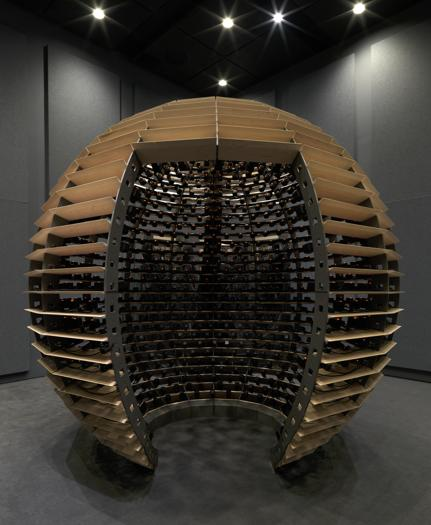

# Conférence de Jade Séguela: Un métier peu ordinnaire!

#### 25 mars 2025

Nous sommes allés voir une conférence de Jade Séguela, la registraire du studio Lozano-Hemmer, dans le but de mieux comprendre comment fonctionnent les entreprises qui travaillent dans l'art multimédia. Dans un premier temps, Mme Séguela nous a expliqué en quoi consiste son travail peu ordinaire. Son métier consiste en fait à s'occuper de l'entièreté de l'import/export des projets du studio, donc elle doit s'assurer d'avoir de bons liens avec les douaniers, s'assurer que l'œuvre peut rentrer dans des cadres de portes conventionnels, s'assurer que l'œuvre peut supporter des enjeux liés aux lieux (corrosion, pluie, électricité, sable, température, etc.) et s'assurer des ventes des projets du studio. Ensuite, elle nous a parlé un peu plus du studio Lozano-Hemmer, le studio de Rafael Lozano-Hemmer. Le principal but de l'entreprise est de faire des œuvres destinées à un public. D'après lui, « Si il n'a pas de public, il n'y a pas d'œuvre ». Leurs œuvres sont souvent plus passives qu'interactives, cela veut dire qu'ils préfèrent faire des œuvres où l'on doit marcher, regarder ou respirer pour l'activer. Par exemple, un de leurs projets récents est Sphere Packing: Bach. Cette œuvre est une sphère en bois avec une quantité astronomique de fils reliés à 1 128 haut-parleurs qui jouent tous une musique différente du compositeur Jean-Sébastien Bach. Cette sphère ne requiert aucune interactivité. La seule chose que l'on doit faire, c'est de rentrer dans la sphère et d'écouter. Pour finir, je vous conseille grandement d'aller visiter sa conférence si le sujet vous intéresse et que vous voulez plus d'informations !
sphere packing:Bach
:-------------------------:

## Légende

cette photo a été prise sur le site du studio Lozanno Hemmer [lien vers le site](https://lozano-hemmer.com/sphere_packing_bach.php)
